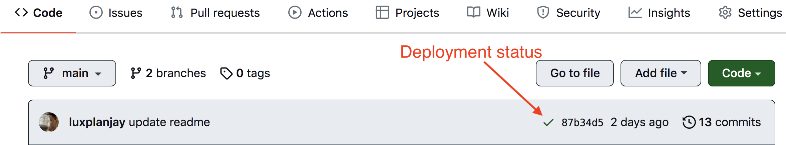
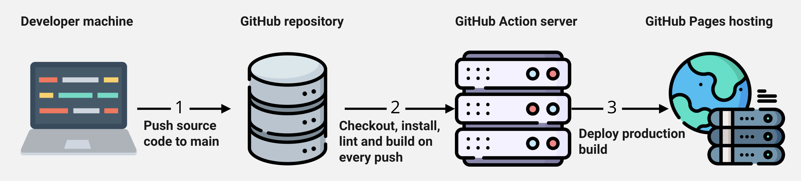

# Vanilla App Template

This project was created using Vite. To get acquainted and set up additional
features, [refer to the documentation](https://vitejs.dev/).

## Creating a Repository from a Template

Use this repository of the GoIT organization as a template to create a
repository for your project. To do this, click the `“Use this template”` button
and choose the `“Create a new repository”` option, as shown in the image.


At the next stage, a page for creating a new repository will open. Fill in the
name field, make sure the repository is public, and then click the
`“Create repository from template”` button.


After the repository is created, you need to go to the settings of the created
repository on the `Settings` > `Actions` > `General` tab as shown in the image.


Scroll down to the bottom of the page, and in the `“Workflow permissions”`
section, select the `“Read and write permissions”` option and check the
checkbox. This is necessary for automating the deployment process of the
project.


Now you have a personal project repository with the file and folder structure of
the template repository. Work with it as you would with any other personal
repository: clone it to your computer, write code, make commits, and push them
to GitHub.

## Getting Started

1. Make sure that you have the LTS version of Node.js installed on your
   computer. [Download and install](https://nodejs.org/en/) it if necessary.
2. Install the project's basic dependencies in the terminal with the command
   `npm install`.
3. Start development mode by executing the command `npm run dev` in the
   terminal.
4. Open your browser at [http://localhost:5173](http://localhost:5173). This
   page will automatically reload after saving changes to the project files.

## Files and Folders

- The markup files for the page components should be located in the
  `src/partials` folder and imported into the `index.html` file. For example,
  create the header markup file `header.html` in the `partials` folder and
  import it into `index.html`.
- Style files should be in the `src/css` folder and imported into the HTML files
  of the pages. For example, the style file for `index.html` is called
  `index.css`.
- Add images to the `src/img` folder. The builder optimizes them, but only
  during the deployment of the production version of the project. All this
  happens in the cloud to avoid overloading your computer because it can take a
  long time on weak machines.

## Deployment

The production version of the project will be automatically built and deployed
to GitHub Pages, in the `gh-pages` branch, every time the `main` branch is
updated. For example, after a direct push or an accepted pull request. To do
this, you need to change the value of the flag `--base=/<REPO>/` in the
`package.json` file for the `build` command, replacing `<REPO>` with the name of
your repository, and push the changes to GitHub.

```json
"build": "vite build --base=/<REPO>/",
```

Next, you need to go to the settings of the GitHub repository (`Settings` >
`Pages`) and set the distribution of the production version files from the
`/root` folder of the `gh-pages` branch, if this was not done automatically.


### Deployment Status

The deployment status of the latest commit is displayed by an icon next to its
identifier.

- **Yellow** - project is being built and deployed.
- **Green** - deployment was successful.
- **Red** - an error occurred during linting, building, or deploying.

You can view more detailed information about the status by clicking on the icon
and going to the `Details` link in the pop-up window.



### Live Page

After a while, usually a few minutes, the live page will be available at the
address specified in the `Settings` > `Pages` tab in the repository settings.
For example, here is the link to the live version for this repository:

[https://goitacademy.github.io/vanilla-app-template/](https://goitacademy.github.io/vanilla-app-template/).

If a blank page opens, make sure there are no errors in the `Console` tab
related to incorrect paths to the project's CSS and JS files (**404**). Most
likely, you have an incorrect value for the `--base` flag for the `build`
command in the `package.json` file.

## How It Works



1. After each push to the `main` branch of the GitHub repository, a special
   script (GitHub Action) from the `.github/workflows/deploy.yml` file runs.
2. All repository files are copied to the server, where the project is
   initialized and goes through linting and building before deployment.
3. If all steps were successful, the built production version of the project
   files is sent to the `gh-pages` branch. Otherwise, the execution log of the
   script will indicate what the problem is.
